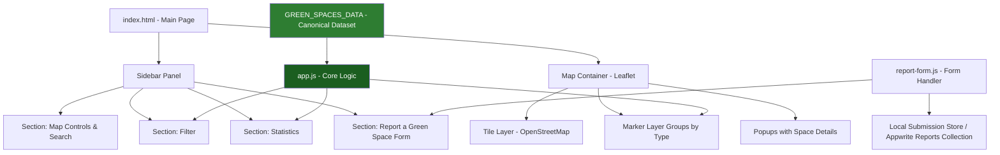
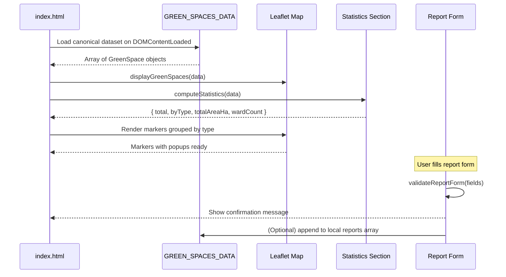

# Design Document: GIS Green Spaces Enhancement

## Overview

This feature enhances the existing Kitwe Green Spaces GIS web application by adding a statistics section, a "Report a Green Space" form, improved UI structure, and a clearly defined dynamic dataset — all without removing or breaking the existing Leaflet map, markers, popups, or filtering functionality.

The system is a frontend-only HTML/CSS/JavaScript application using Leaflet.js for mapping, with data sourced from a canonical JavaScript dataset (`GREEN_SPACES_DATA`) that is shared across all features. The Flask/PostgreSQL backend and Appwrite integration remain available but the primary data source for the frontend is the static dataset already present in `static-data.js` / `fallback-data.js`, extended and unified into a single authoritative source.

---

## Architecture



### Data Flow



---

## Components and Interfaces

### Component 1: Canonical Dataset (`GREEN_SPACES_DATA`)

**Purpose**: Single source of truth for all green space records used by the map, filters, and statistics.

**Interface**:
```typescript
interface GreenSpace {
  id: number
  name: string
  type: 'park' | 'garden' | 'forest' | 'recreational' | 'golf_course' | 'public_square' | 'sports_field' | 'wetland'
  ward: string
  area_sq_m: number
  latitude: number
  longitude: number
  description?: string
  facilities?: string
  accessibility?: string
}

// Exported as a GeoJSON FeatureCollection for Leaflet compatibility
interface GreenSpaceFeature {
  type: 'Feature'
  geometry: { type: 'Point'; coordinates: [number, number] }  // [lng, lat]
  properties: GreenSpace
}

interface GreenSpacesDataset {
  type: 'FeatureCollection'
  features: GreenSpaceFeature[]
}

// Global: window.GREEN_SPACES_DATA: GreenSpacesDataset
```

**Responsibilities**:
- Provide all 51 Kitwe green space records with consistent field names
- Be the single import used by `app.js`, statistics, and filter logic
- Replace the split between `static-data.js` and `fallback-data.js`

---

### Component 2: Map Section (existing, preserved)

**Purpose**: Renders the interactive Leaflet map with markers, popups, and layer controls.

**Interface** (existing functions, unchanged signatures):
```typescript
function initializeMap(): void
function displayGreenSpaces(features: GreenSpaceFeature[]): void
function filterGreenSpaces(): void
function zoomToLocation(lat: number, lng: number): void
function populateWardFilter(features: GreenSpaceFeature[]): void
```

**Responsibilities**:
- Initialize Leaflet map centred on Kitwe (`[-12.8130, 28.2200]`, zoom 13)
- Render colour-coded markers grouped by type into `layerGroups`
- Bind popups with name, type, area, ward, and action buttons
- Respond to filter changes from the Filter section

---

### Component 3: Filter Section (existing, preserved)

**Purpose**: Allows users to filter visible markers by type, ward, and minimum area.

**Interface** (existing, unchanged):
```typescript
function filterGreenSpaces(): void   // reads DOM filter values, calls displayGreenSpaces
function resetFilters(): void
```

---

### Component 4: Statistics Section (new)

**Purpose**: Displays aggregate counts and breakdowns derived from the currently loaded dataset.

**Interface**:
```typescript
interface StatisticsSummary {
  total: number
  totalAreaHa: number
  wardCount: number
  byType: Record<string, number>   // e.g. { park: 15, garden: 12, forest: 10, ... }
}

function computeStatistics(features: GreenSpaceFeature[]): StatisticsSummary
function renderStatistics(summary: StatisticsSummary): void
function updateStatistics(features: GreenSpaceFeature[]): void  // calls compute + render
```

**Responsibilities**:
- Count total green spaces
- Sum total area and convert to hectares
- Count distinct wards
- Count spaces per type and render a type-breakdown list
- Re-render whenever filters change (receives filtered subset)

---

### Component 5: Report a Green Space Form (new)

**Purpose**: Lets citizens submit a new green space suggestion with a name, type, ward, and description. Shows a confirmation message on success.

**Interface**:
```typescript
interface GreenSpaceReport {
  reporterName: string
  spaceName: string
  spaceType: string
  ward: string
  description: string
  submittedAt: string   // ISO timestamp
}

function validateReportForm(report: Partial<GreenSpaceReport>): { valid: boolean; errors: string[] }
function submitReport(report: GreenSpaceReport): void
function showConfirmation(spaceName: string): void
function resetReportForm(): void
```

**Responsibilities**:
- Validate all required fields before submission
- Show inline validation errors
- On valid submission: display a confirmation banner with the space name, then reset the form
- Optionally store submissions in `localStorage` or POST to `/api/add-green-space`

---

## Data Models

### GreenSpace (canonical)

```typescript
interface GreenSpace {
  id: number           // unique integer
  name: string         // display name, non-empty
  type: string         // one of the defined type values
  ward: string         // Kitwe ward name
  area_sq_m: number    // area in square metres, >= 0
  latitude: number     // WGS84 latitude
  longitude: number    // WGS84 longitude
  description?: string
  facilities?: string
  accessibility?: string
}
```

**Validation Rules**:
- `id` must be unique across all records
- `name` must be non-empty string
- `type` must be one of: `park`, `garden`, `forest`, `recreational`, `golf_course`, `public_square`, `sports_field`, `wetland`
- `latitude` must be in range `[-90, 90]`
- `longitude` must be in range `[-180, 180]`
- `area_sq_m` must be `>= 0`

### GreenSpaceReport (form submission)

```typescript
interface GreenSpaceReport {
  reporterName: string   // non-empty
  spaceName: string      // non-empty
  spaceType: string      // non-empty, from type list
  ward: string           // non-empty
  description: string    // non-empty, min 10 chars
  submittedAt: string    // ISO 8601 timestamp
}
```

**Validation Rules**:
- All fields except `submittedAt` are required
- `description` must be at least 10 characters
- `submittedAt` is set automatically at submission time

---

## Algorithmic Pseudocode

### Main Initialisation Algorithm

```pascal
ALGORITHM initApplication()
INPUT: DOM ready event
OUTPUT: fully rendered map + sidebar sections

BEGIN
  // 1. Load canonical dataset
  data ← GREEN_SPACES_DATA.features

  // 2. Initialise map
  initializeMap()

  // 3. Populate filter dropdowns
  populateWardFilter(data)

  // 4. Render markers
  displayGreenSpaces(data)

  // 5. Compute and render statistics
  updateStatistics(data)

  // 6. Attach filter event listeners
  ATTACH filterGreenSpaces TO applyFilters.click
  ATTACH resetFilters TO resetFilters.click
  ATTACH updateAreaLabel TO areaRange.input

  // 7. Attach report form listener
  ATTACH handleReportSubmit TO reportForm.submit
END
```

### Statistics Computation Algorithm

```pascal
ALGORITHM computeStatistics(features)
INPUT: features — array of GreenSpaceFeature
OUTPUT: StatisticsSummary

BEGIN
  total ← LENGTH(features)
  totalAreaSqM ← 0
  wards ← empty Set
  byType ← empty Map

  FOR each feature IN features DO
    props ← feature.properties

    totalAreaSqM ← totalAreaSqM + (props.area_sq_m OR 0)

    IF props.ward IS NOT NULL THEN
      wards.add(props.ward)
    END IF

    count ← byType.get(props.type) OR 0
    byType.set(props.type, count + 1)
  END FOR

  totalAreaHa ← ROUND(totalAreaSqM / 10000, 1)
  wardCount ← SIZE(wards)

  RETURN { total, totalAreaHa, wardCount, byType }
END
```

**Preconditions**:
- `features` is a valid array (may be empty)
- Each feature has a `properties` object with at least `type` and `area_sq_m`

**Postconditions**:
- `total` equals `LENGTH(features)`
- `totalAreaHa` is non-negative
- `byType` contains an entry for every distinct type present in `features`

**Loop Invariants**:
- After processing `k` features: `totalAreaSqM` equals the sum of `area_sq_m` for the first `k` features

---

### Report Form Validation Algorithm

```pascal
ALGORITHM validateReportForm(report)
INPUT: report — partial GreenSpaceReport object
OUTPUT: { valid: boolean, errors: string[] }

BEGIN
  errors ← empty array

  IF report.reporterName IS EMPTY THEN
    errors.append("Reporter name is required")
  END IF

  IF report.spaceName IS EMPTY THEN
    errors.append("Space name is required")
  END IF

  IF report.spaceType IS EMPTY THEN
    errors.append("Space type is required")
  END IF

  IF report.ward IS EMPTY THEN
    errors.append("Ward is required")
  END IF

  IF report.description IS EMPTY THEN
    errors.append("Description is required")
  ELSE IF LENGTH(report.description) < 10 THEN
    errors.append("Description must be at least 10 characters")
  END IF

  RETURN { valid: (LENGTH(errors) = 0), errors }
END
```

**Preconditions**:
- `report` is a defined object (fields may be undefined/empty)

**Postconditions**:
- `valid` is `true` if and only if `errors` is empty
- No mutations to `report`

---

### Report Submission Algorithm

```pascal
ALGORITHM handleReportSubmit(event)
INPUT: form submit event
OUTPUT: confirmation message shown OR errors displayed

BEGIN
  event.preventDefault()

  report ← collectFormValues()
  report.submittedAt ← NOW().toISOString()

  result ← validateReportForm(report)

  IF result.valid = false THEN
    displayFormErrors(result.errors)
    RETURN
  END IF

  clearFormErrors()
  submitReport(report)
  showConfirmation(report.spaceName)
  resetReportForm()
END

ALGORITHM submitReport(report)
INPUT: valid GreenSpaceReport
OUTPUT: stored locally (and optionally sent to API)

BEGIN
  // Store in localStorage for persistence
  existing ← JSON.parse(localStorage.getItem("greenSpaceReports") OR "[]")
  existing.append(report)
  localStorage.setItem("greenSpaceReports", JSON.stringify(existing))

  // Optional: POST to backend if available
  TRY
    fetch("/api/add-green-space", { method: "POST", body: JSON.stringify(report) })
  CATCH error
    // Silently ignore — local storage is the primary store
  END TRY
END
```

---

## Key Functions with Formal Specifications

### `computeStatistics(features)`

```typescript
function computeStatistics(features: GreenSpaceFeature[]): StatisticsSummary
```

**Preconditions**:
- `features` is a non-null array
- Each element has `properties.type` (string) and `properties.area_sq_m` (number or undefined)

**Postconditions**:
- `result.total === features.length`
- `result.totalAreaHa >= 0`
- `result.wardCount >= 0`
- `Object.values(result.byType).reduce((a,b) => a+b, 0) === features.length`

---

### `validateReportForm(report)`

```typescript
function validateReportForm(report: Partial<GreenSpaceReport>): { valid: boolean; errors: string[] }
```

**Preconditions**:
- `report` is a defined object

**Postconditions**:
- `result.valid === (result.errors.length === 0)`
- `result.errors` contains one entry per failed validation rule
- `report` is not mutated

---

### `updateStatistics(features)`

```typescript
function updateStatistics(features: GreenSpaceFeature[]): void
```

**Preconditions**:
- DOM elements `#stat-total`, `#stat-area`, `#stat-wards`, `#stat-by-type` exist

**Postconditions**:
- DOM elements reflect values from `computeStatistics(features)`
- No side effects on `features`

---

### `showConfirmation(spaceName)`

```typescript
function showConfirmation(spaceName: string): void
```

**Preconditions**:
- `spaceName` is a non-empty string
- DOM element `#report-confirmation` exists

**Postconditions**:
- `#report-confirmation` is visible and contains `spaceName`
- Confirmation auto-hides after 5 seconds

---

## Example Usage

```javascript
// 1. Load data and initialise on page load
document.addEventListener('DOMContentLoaded', () => {
  const features = GREEN_SPACES_DATA.features

  initializeMap()
  populateWardFilter(features)
  displayGreenSpaces(features)
  updateStatistics(features)
  setupReportForm()
})

// 2. Statistics update after filtering
function filterGreenSpaces() {
  const typeFilter = document.getElementById('filterType').value
  const wardFilter = document.getElementById('filterWard').value
  const minArea = parseInt(document.getElementById('areaRange').value)

  let filtered = GREEN_SPACES_DATA.features

  if (typeFilter !== 'all') filtered = filtered.filter(f => f.properties.type === typeFilter)
  if (wardFilter !== 'all') filtered = filtered.filter(f => f.properties.ward === wardFilter)
  filtered = filtered.filter(f => (f.properties.area_sq_m || 0) >= minArea)

  displayGreenSpaces(filtered)
  updateStatistics(filtered)   // statistics always reflect current filtered view
}

// 3. Report form submission
document.getElementById('reportForm').addEventListener('submit', (e) => {
  e.preventDefault()
  const report = {
    reporterName: document.getElementById('reporterName').value.trim(),
    spaceName: document.getElementById('spaceName').value.trim(),
    spaceType: document.getElementById('spaceType').value,
    ward: document.getElementById('spaceWard').value.trim(),
    description: document.getElementById('spaceDescription').value.trim(),
    submittedAt: new Date().toISOString()
  }
  const { valid, errors } = validateReportForm(report)
  if (!valid) { displayFormErrors(errors); return }
  submitReport(report)
  showConfirmation(report.spaceName)
  resetReportForm()
})
```

---

## UI Structure

The sidebar is reorganised into four clearly labelled collapsible sections:

```
Sidebar
├── [Section 1] 🗺 Map Controls
│   ├── Logo + title
│   ├── Search input
│   └── Find Parks Near Me button
│
├── [Section 2] 🔍 Filter
│   ├── Type dropdown
│   ├── Ward dropdown
│   ├── Area range slider
│   └── Apply / Reset buttons
│
├── [Section 3] 📊 Statistics          ← NEW
│   ├── Total green spaces count
│   ├── Total area (hectares)
│   ├── Wards covered
│   └── Count by type (list/grid)
│
└── [Section 4] 📝 Report a Green Space ← NEW
    ├── Reporter name input
    ├── Space name input
    ├── Type dropdown
    ├── Ward input
    ├── Description textarea
    ├── Submit button
    └── Confirmation message (shown on success)
```

---

## Error Handling

### Error Scenario 1: Dataset fails to load

**Condition**: `GREEN_SPACES_DATA` is undefined at runtime (script load failure)
**Response**: `app.js` checks `window.GREEN_SPACES_DATA` and falls back to `window.FALLBACK_GREEN_SPACES`
**Recovery**: Map renders with fallback data; a toast notification informs the user

### Error Scenario 2: Report form validation failure

**Condition**: User submits form with missing or invalid fields
**Response**: `validateReportForm` returns errors; inline error messages appear below each invalid field
**Recovery**: User corrects fields and resubmits; no data is stored until validation passes

### Error Scenario 3: Backend API unavailable for report submission

**Condition**: `fetch('/api/add-green-space')` throws a network error
**Response**: Error is caught silently; report is still saved to `localStorage`
**Recovery**: User sees the confirmation message; data is not lost

### Error Scenario 4: Statistics DOM elements missing

**Condition**: `updateStatistics` is called before the DOM is ready or elements are renamed
**Response**: Each DOM update is guarded with a null check (`if (el) el.textContent = value`)
**Recovery**: Statistics silently skip missing elements; no JS exception thrown

---

## Correctness Properties

*A property is a characteristic or behavior that should hold true across all valid executions of a system—essentially, a formal statement about what the system should do. Properties serve as the bridge between human-readable specifications and machine-verifiable correctness guarantees.*

### Property 1: Dataset Record Field Completeness

*For any* GreenSpace record in the dataset, it SHALL contain all required fields: id, name, type, ward, area_sq_m, latitude, and longitude.

**Validates: Requirement 1.4**

### Property 2: Unique Record Identifiers

*For any* dataset of GreenSpace records, all id values SHALL be unique integers with no duplicates.

**Validates: Requirement 2.1**

### Property 3: Non-Empty Names

*For any* GreenSpace record, the name field SHALL be a non-empty string.

**Validates: Requirement 2.2**

### Property 4: Valid Type Values

*For any* GreenSpace record, the type field SHALL be one of the valid types: park, garden, forest, recreational, golf_course, public_square, sports_field, or wetland.

**Validates: Requirement 2.3**

### Property 5: Valid Latitude Range

*For any* GreenSpace record, the latitude field SHALL be a number in the range [-90, 90].

**Validates: Requirement 2.4**

### Property 6: Valid Longitude Range

*For any* GreenSpace record, the longitude field SHALL be a number in the range [-180, 180].

**Validates: Requirement 2.5**

### Property 7: Non-Negative Area

*For any* GreenSpace record, the area_sq_m field SHALL be greater than or equal to 0.

**Validates: Requirement 2.6**

### Property 8: Marker Count Matches Dataset

*For any* dataset of GreenSpace features, when rendered on the map, the total number of markers SHALL equal the number of features in the dataset.

**Validates: Requirement 3.2**

### Property 9: Markers Grouped by Type

*For any* dataset of GreenSpace features, all markers with the same type SHALL be grouped into the same layer group.

**Validates: Requirement 3.3**

### Property 10: Type-Consistent Marker Colors

*For any* marker on the map, its color SHALL match the color assigned to its green space type.

**Validates: Requirement 3.4**

### Property 11: Popup Content Completeness

*For any* marker on the map, when clicked, the popup SHALL display the green space name, type, area, and ward.

**Validates: Requirement 3.5**

### Property 12: Filter Result Validity

*For any* filter criteria (type, ward, minimum area) and any dataset, all visible markers after filtering SHALL satisfy all selected filter criteria.

**Validates: Requirement 4.4**

### Property 13: Statistics Match Filtered Data

*For any* filter applied to the dataset, the displayed statistics SHALL accurately reflect only the filtered subset of green spaces.

**Validates: Requirements 4.5, 5.5**

### Property 14: Filter Reset Restores Original State

*For any* initial dataset state, applying filters and then resetting SHALL restore all markers and statistics to the original unfiltered state.

**Validates: Requirement 4.6**

### Property 15: Filter Preserves Map Position

*For any* filter operation, the map center coordinates and zoom level SHALL remain unchanged before and after the filter is applied.

**Validates: Requirement 4.7**

### Property 16: Area Conversion Accuracy

*For any* area value in square metres, the conversion to hectares SHALL equal the value divided by 10000 and rounded to 1 decimal place.

**Validates: Requirement 5.6**

### Property 17: Statistics Type Count Invariant

*For any* dataset of GreenSpace features, the sum of all type counts in the statistics breakdown SHALL equal the total count of green spaces.

**Validates: Requirement 5.7**

### Property 18: Form Validation Error Completeness

*For any* report submission with missing required fields, the validation SHALL return an error message for each missing field.

**Validates: Requirement 6.2**

### Property 19: Description Length Validation

*For any* report with a description shorter than 10 characters, the validation SHALL reject the submission with an appropriate error message.

**Validates: Requirement 6.3**

### Property 20: Valid Report Acceptance

*For any* report with all required fields filled and description length >= 10 characters, the validation SHALL accept the submission as valid.

**Validates: Requirement 6.4**

### Property 21: Failed Validation Preserves Form State

*For any* invalid report submission, the form fields SHALL retain their values after the validation failure.

**Validates: Requirement 6.7**

### Property 22: Report LocalStorage Persistence

*For any* valid report submission, the report SHALL be stored in browser localStorage and retrievable after submission.

**Validates: Requirement 7.1**

### Property 23: Automatic Timestamp Addition

*For any* valid report submission, the stored report SHALL include a submittedAt field with a valid ISO 8601 timestamp.

**Validates: Requirement 7.2**

### Property 24: Confirmation Message Contains Space Name

*For any* valid report submission with space name X, the confirmation message SHALL contain the space name X.

**Validates: Requirement 7.3**

### Property 25: Form Cleared After Successful Submission

*For any* valid report submission, all form fields SHALL be empty after the submission completes successfully.

**Validates: Requirement 7.4**

### Property 26: API Failure Does Not Prevent Local Storage

*For any* valid report submission where the backend API call fails, the report SHALL still be stored in localStorage and the confirmation message SHALL still be displayed.

**Validates: Requirement 7.7**

### Property 27: Missing DOM Elements Handled Gracefully

*For any* statistics update operation where a required DOM element is missing, the function SHALL complete without throwing an error.

**Validates: Requirement 9.3**

### Property 28: LocalStorage Report Persistence Round-Trip

*For any* valid report, after submission, retrieving reports from localStorage SHALL include the submitted report with all its fields intact.

**Validates: Requirements 11.2, 11.3**

### Property 29: LocalStorage JSON Parse Error Handling

*For any* invalid JSON string in localStorage under the key "greenSpaceReports", the parsing operation SHALL handle the error gracefully without crashing.

**Validates: Requirement 11.5**

### Property 30: HTML Escaping Prevents XSS

*For any* user-submitted description text containing HTML or script tags, when displayed, the content SHALL be HTML-escaped to prevent script execution.

**Validates: Requirement 12.1**

### Property 31: Input Whitespace Trimming

*For any* text input field with leading or trailing whitespace, the value SHALL be trimmed before validation.

**Validates: Requirement 12.2**

---

## Testing Strategy

### Unit Testing Approach

Test pure functions in isolation using a test runner (e.g., Jest or Vitest):

- `computeStatistics([])` → `{ total: 0, totalAreaHa: 0, wardCount: 0, byType: {} }`
- `computeStatistics(allFeatures)` → total equals 51, byType sums to 51
- `validateReportForm({})` → `valid: false`, errors array has 5 entries
- `validateReportForm(validReport)` → `valid: true`, errors is empty
- `validateReportForm({ ...validReport, description: 'short' })` → error on description

### Property-Based Testing Approach

**Property Test Library**: fast-check

All 31 correctness properties listed above should be implemented as property-based tests with minimum 100 iterations each. Each test should reference its corresponding property number and requirement in the test description.

### Integration Testing Approach

- Load `index.html` in a browser (or jsdom) and verify:
  - Statistics section shows correct total after page load
  - Applying a type filter updates both the map markers and the statistics count
  - Submitting a valid report shows the confirmation message and clears the form
  - Submitting an invalid report shows error messages without clearing the form

---

## Performance Considerations

- The canonical dataset is ~51 records; all filtering and statistics computation is O(n) and runs in < 1ms — no pagination or lazy loading needed at this scale.
- `displayGreenSpaces` clears and re-renders all markers on each filter change. With 51 markers this is negligible; if the dataset grows beyond ~500 records, consider using a Leaflet marker cluster plugin.
- Statistics are recomputed synchronously on each filter change. This is acceptable at current scale.

---

## Security Considerations

- The report form does not send data to a public endpoint by default (localStorage only). If the optional backend POST is enabled, inputs must be sanitised server-side before database insertion.
- No authentication is required for viewing the map or submitting a report (public-facing feature).
- The `description` field should be HTML-escaped before rendering anywhere in the DOM to prevent XSS.

---

## Dependencies

| Dependency | Version | Purpose |
|---|---|---|
| Leaflet.js | 1.9.4 | Interactive map rendering |
| Bootstrap | 5.3.0 | UI layout and components |
| Font Awesome | 6.4.0 | Icons |
| OpenStreetMap | — | Tile layer |
| Appwrite SDK | cloud | Optional: remote data & report storage |
| Flask + psycopg2 | — | Optional: backend API for green spaces |
